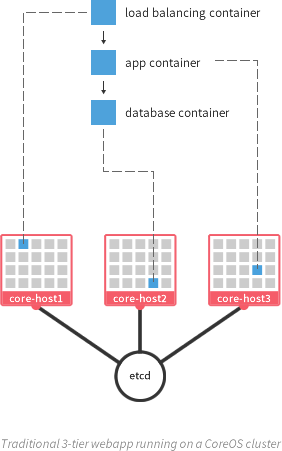
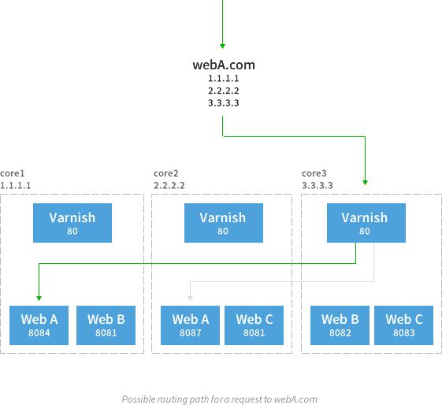

varnish_etcd
============

Dynamically apply Varnish VCL based on data from etcd. Intended to be used on CoreOS from within a container. This repository is primarily for the Ruby script, but contains a quick guide as well.

## Overview

Run a simple three node CoreOS cluster. To reduce costs, I opted to do DNS round robin instead of running these behind a load balancer. This means that each machine runs a copy of Varnish for routing and multiple containers that contain webservers and other applications. Varnish will load balance traffic to containers even if they don't reside on the same host as the Varnish instance. A later optimization would be to weight the backends to prefer containers on the same machine.





## Assumptions

1. You're running on CoreOS or a machine that has [etcd](http://coreos.com/docs/guides/etcd/) addressable on 172.17.42.1 (the `docker0` bridge) 
2. Your CoreOS machine(s) is running on a cloud provider that has free networking between hosts. I use the hostname of the box to route traffic between instances.

## Set Up systemd Service Files

Each container is run/stopped/maintained by systemd in a "unit" file. I use two different types of unit files. One that simply starts a container and another that communicates to etcd when the container is started or stopped.

### varnish.service

Simply starts my Varnish container on port 80 and runs `boot-varnish.sh`.

```
[Unit]
Description=Varnish
After=docker.service

[Service]
Restart=always
ExecStart=/usr/bin/docker run -p 80:80 index.robszumski.com/varnish /bin/sh /root/boot-varnish.sh

[Install]
WantedBy=local.target
```

### robszumski.service

Starts my website container on 8082 and runs `boot=apache.sh`. The `ExecStartPost` runs after the container has started and tells etcd what hostname and port combination to send traffic to. The `%H` is a systemd variable for the hostname of the machine. `ExecStop` removes the etcd entry when the container is stopped.

```
[Unit]
Description=robszumski
After=docker.service

[Service]
Restart=always
ExecStart=/usr/bin/docker run -p 8082:80 index.robszumski.com/robszumski /bin/sh /root/boot-apache.sh
ExecStartPost=/usr/bin/etcdctl set /domains/robszumski.com/%H:8082 running
ExecStop=/usr/bin/etcdctl delete /domains/robszumski.com/%H:8082

[Install]
WantedBy=local.target
```

## Construct Containers

I'm not going to walk you through installing the software but there are two scripts that I use to start services within the container that are kinda ghetto and I want to explain what they do. Since `docker run` can only run a single command, it's easier to write a shell script that starts up things that you need running.

### boot-apache.sh

This script just starts Apache in the foreground so the container stops if it crashes. This will cause systemd to remove the container from etcd and prevent it from receiving traffic.

```
#!/bin/sh

echo 'Starting apache2 now...'
/usr/sbin/apache2ctl -D FOREGROUND
```

### boot-varnish.sh

This script is a little more involved. First it fetches all of the containers that have announced themselves on the `domains` key in etcd and parses them into a Varnish VCL file. After this file is in place, Varnish is started. It should now be serving traffic to all of the containers in round robin fashion with health checks enabled. The second part of the script is an infinite loop that watches our `domains` key and reloads Varnish when it detects that the key has changed. A known limitation is that this could happen very often if you're contantly starting and stopping containers...so don't do that.

```
#!/bin/sh

echo 'Reading etcd values...'
ruby /etc/varnish_etcd/varnish_etcd.rb

echo 'Starting varnish now...'
service varnish start

echo 'Varnish started, responding to requests until etcd values change'

while :;
do
  curl -L http://172.17.42.1:4001/v1/watch/domains;
  ruby /etc/varnish_etcd/varnish_etcd.rb;
  service varnish reload;
done
```

